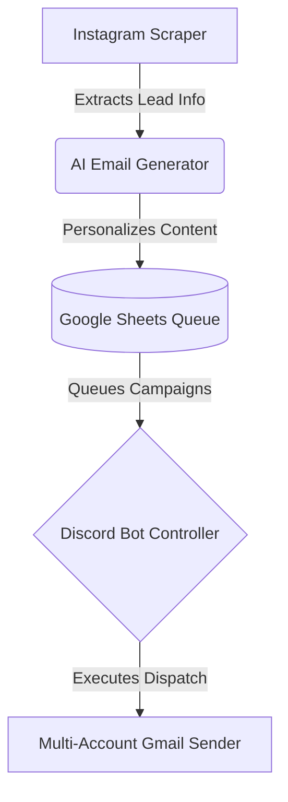

<div align="center">

# 🚀 AI Instagram Cold Outreach Bot

**An intelligent, scalable, and automated cold email outreach solution powered by AI.**

[](https://www.python.org/downloads/)
[](https://opensource.org/licenses/MIT)
[](https://pycord.dev/)
[](https://developers.google.com/sheets/api)
[]()

<p align="center">
  Automate your lead generation, scrape Instagram data, generate hyper-personalized AI emails, and seamlessly orchestrate multi-account outreach workflows via Discord.
</p>

</div>

---

## 🌟 Key Features

- **🔍 Smart Instagram Scraping:** Automatically extract metadata, bios, and engagement data from Instagram profiles.
- **🤖 AI-Powered Personalization:** Generate hyper-personalized cold emails and highly contextual follow-ups using advanced LLMs.
- **📊 Google Sheets Native:** Manage your entire workflow directly from Google Sheets (`Day1Queue`, `Day2Queue`, etc.).
- **💌 Multi-Account Sending:** Distribute sending load across multiple Gmail accounts with customizable delays and smart thread handling.
- **🎮 Discord Orchestration:** Control your entire outreach campaign remotely using convenient Discord slash commands.
- **🛡️ Built-in Safety Controls:** Shared rate limits, dynamic retry logic, and quota management to protect your sender reputation.

---

## 🏗️ System Architecture



## 📂 Project Structure

```text
📦 AI-Outreach-Agent
 ┣ 📂 commands/         # Discord command cogs for outreach workflows
 ┣ 📂 utils/            # Shared utilities (AI, rate limiting, Google Sheets)
 ┣ 📂 logs/             # Runtime execution logs and state tracking
 ┣ 📜 scrapper.py       # Scrapes leads, generates emails, and builds queues
 ┣ 📜 discord_bot.py    # Core email dispatch and queue processor
 ┣ 📜 main.py           # Discord Bot launcher and command sync
 ┣ 📜 verify_setup.py   # Diagnostics and environment validation
 ┣ 📜 SETUP.md          # Detailed installation and setup guide
 ┗ 📜 rate_limits.json  # Centralized configuration for quotas/limits
```

---

## 💻 Tech Stack

- **Core:** Python `>= 3.13`
- **Bot Framework:** `py-cord` / `discord.py`
- **Database / Queue:** `gspread` + Google Sheets API + `pandas`
- **AI Integration:** `google-generativeai` / `openai`
- **Networking:** `requests`, `tenacity` (Dynamic Retries)
- **Delivery:** Multi-account threaded Gmail dispatch via App Passwords

---

## 🚀 Quick Start Guide

### 1. Prerequisites
- Python 3.13 or higher installed.
- A Google Cloud Service Account (for Sheets API).
- A Discord App/Bot token and your Guild ID.
- API Key(s) for your preferred AI provider (e.g., Gemini / OpenAI).
- One or more Gmail App Passwords for sending emails.
- A base Google Sheet configured with a `Leads` tab.

### 2. Installation

Clone the repository and install the dependencies:

```bash
# Upgrade pip
python -m pip install --upgrade pip

# Install required packages
python -m pip install audioop-lts generativeai>=0.0.1 google-generativeai>=0.8.5 gspread openai>=1.104.1 pandas pandas-stubs py-cord python-dotenv requests tenacity>=9.1.2
```

### 3. Configuration
Create a `.env` file in the root directory. Refer to [SETUP.md](./SETUP.md) for full configuration details.

```env
# Discord Settings
DISCORD_BOT_TOKEN=your_bot_token
MY_GUILD_ID=your_guild_id

# Google Sheets Configuration
GOOGLE_SHEETS_SPREADSHEET_ID=your_sheet_id
GOOGLE_SHEETS_TYPE=service_account
# Add the remaining Google service account fields here...

# AI Provider Keys
AI_PROVIDER=gemini # or openai
GEMINI_API_KEY_1=your_ai_key
# Add more keys to enable rotation...

# Email Sender Config
EMAIL_ADDRESS_1=sender1@gmail.com
EMAIL_PASSWORD_1=app_password_1
# Add more accounts for scale...
```

*⚠️ Ensure you NEVER commit your `.env` or `service_account.json` files to version control.*

---

## 🕹️ Usage & Workflow

**1. Data Collection & Email Generation**
Add your target Instagram URLs or handles to the `Leads` sheet. Then run the scraper compiler:
```bash
python scrapper.py
```
*(This will fetch profiles, draft personalized emails, and populate your queue tabs like `Day1Queue`)*

**2. Launch the Orchestrator Bot**
Start the Discord command interface:
```bash
python main.py
```

**3. Dispatch Campaigns via Discord**
Use intuitive slash commands within your Discord server to launch and control campaigns:
- **Send Initial Pitch:** `/send queue:Day1Queue count:100 delay:5`
- **Send Follow-ups:** `/sendfollow queue:Day1Queue followup:1 count:50 delay:5`

Monitor logs and quota usage directly inside the `/logs` directory.

---

## 🤝 Contributing

We welcome contributions to make this bot more robust and feature-rich! 

1. **Fork** the repository
2. **Create** a feature branch (`git checkout -b feature/amazing-feature`)
3. **Commit** your changes (`git commit -m 'Add amazing feature'`)
4. **Push** to the branch (`git push origin feature/amazing-feature`)
5. Open a **Pull Request**

*We are particularly looking for help with test coverage, expanded AI integrations, and advanced delivery strategies.*

---

## 📝 Important Disclaimer

**Use Responsibly:** This tool is designed for B2B outreach and networking. Users are strictly responsible for complying with the CAN-SPAM Act, GDPR, and all applicable anti-spam laws in their respective jurisdictions. Do not spam.

---
<div align="center">
  <i>Built with ❤️ for automated, high-quality outreach.</i>
</div>
